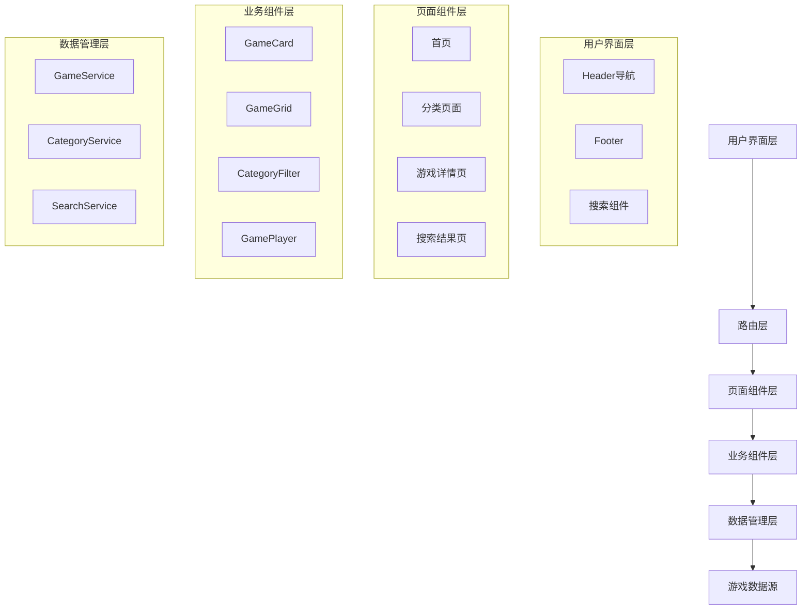

# Design Document

## Overview

本设计将现有的Geometry Dash Spam网站重构为一个更加灵活和可扩展的经典小游戏站点架构。设计重点是创建一个数据驱动的游戏管理系统，同时保持现有的SEO优化和用户体验。

经典小游戏站点的核心特征包括：
- 清晰的游戏分类和导航
- 网格式游戏展示布局
- 搜索和筛选功能
- 游戏详情页面
- 推荐和相关游戏系统
- 响应式设计

## Architecture

### 系统架构概览



### 数据流架构

1. **游戏数据管理**: 集中式游戏数据配置，支持分类、标签、元数据
2. **组件通信**: 使用React Context进行全局状态管理
3. **路由管理**: 基于React Router的动态路由系统
4. **SEO优化**: 保持现有TDK，增强结构化数据

## Components and Interfaces

### 核心数据接口

```typescript
interface Game {
  id: string;
  name: string;
  description: string;
  image: string;
  url: string;
  category: GameCategory;
  tags: string[];
  featured: boolean;
  popularity: number;
  dateAdded: Date;
  metadata?: {
    developer?: string;
    controls?: string;
    instructions?: string;
  };
}

interface GameCategory {
  id: string;
  name: string;
  slug: string;
  description: string;
  icon: string;
  color: string;
}

interface GameFilter {
  category?: string;
  tags?: string[];
  search?: string;
  sortBy?: 'popularity' | 'name' | 'dateAdded';
  sortOrder?: 'asc' | 'desc';
}
```

### 组件架构

#### 1. 数据服务层

**GameService**
- 管理游戏数据的CRUD操作
- 提供搜索和筛选功能
- 处理游戏推荐逻辑

**CategoryService**
- 管理游戏分类
- 提供分类筛选功能

#### 2. 核心UI组件

**GameCard组件**
```typescript
interface GameCardProps {
  game: Game;
  size?: 'small' | 'medium' | 'large';
  showCategory?: boolean;
  showDescription?: boolean;
}
```

**GameGrid组件**
```typescript
interface GameGridProps {
  games: Game[];
  columns?: number;
  loading?: boolean;
  onGameClick?: (game: Game) => void;
}
```

**CategoryFilter组件**
```typescript
interface CategoryFilterProps {
  categories: GameCategory[];
  selectedCategory?: string;
  onCategoryChange: (categoryId: string) => void;
}
```

**SearchBar组件**
```typescript
interface SearchBarProps {
  onSearch: (query: string) => void;
  placeholder?: string;
  suggestions?: string[];
}
```

#### 3. 页面组件重构

**HomePage重构**
- 保持现有内容和SEO结构
- 添加游戏分类导航
- 实现推荐游戏部分
- 集成搜索功能

**CategoryPage (新增)**
- 按分类展示游戏
- 支持筛选和排序
- 分页功能

**GameDetailPage重构**
- 增强游戏信息展示
- 添加相关游戏推荐
- 改进游戏播放体验

## Data Models

### 游戏数据结构

```typescript
// src/data/games.ts
export const gameCategories: GameCategory[] = [
  {
    id: 'geometry-dash',
    name: 'Geometry Dash',
    slug: 'geometry-dash',
    description: 'Rhythm-based platformer challenges',
    icon: 'Triangle',
    color: 'blue'
  },
  {
    id: 'action',
    name: 'Action Games',
    slug: 'action',
    description: 'Fast-paced action adventures',
    icon: 'Zap',
    color: 'red'
  },
  {
    id: 'puzzle',
    name: 'Puzzle Games',
    slug: 'puzzle',
    description: 'Mind-bending puzzle challenges',
    icon: 'Puzzle',
    color: 'green'
  }
];

export const games: Game[] = [
  {
    id: 'geometry-dash-spam-test',
    name: 'Geometry Dash Spam Test',
    description: 'Test your spamming skills in this exciting Geometry Dash challenge!',
    image: 'https://pub-9cd8442eae39491496da90d370d65538.r2.dev/geometry-dash-spam-test.png',
    url: 'https://pub-9cd8442eae39491496da90d370d65538.r2.dev/Geometry-Dash-spam-test.html',
    category: gameCategories[0],
    tags: ['spam', 'challenge', 'rhythm'],
    featured: true,
    popularity: 95,
    dateAdded: new Date('2024-01-01')
  }
  // ... 其他游戏
];
```

### 状态管理

```typescript
// src/context/GameContext.tsx
interface GameContextType {
  games: Game[];
  categories: GameCategory[];
  filteredGames: Game[];
  currentFilter: GameFilter;
  setFilter: (filter: GameFilter) => void;
  searchGames: (query: string) => void;
  getGamesByCategory: (categoryId: string) => Game[];
  getFeaturedGames: () => Game[];
  getRelatedGames: (gameId: string) => Game[];
}
```

## Error Handling

### 错误处理策略

1. **游戏加载失败**
   - 显示友好的错误消息
   - 提供重试选项
   - 记录错误日志

2. **搜索无结果**
   - 显示"未找到游戏"消息
   - 提供搜索建议
   - 显示推荐游戏

3. **网络错误**
   - 实现离线模式
   - 缓存游戏数据
   - 显示连接状态

```typescript
// src/components/ErrorBoundary.tsx
class GameErrorBoundary extends React.Component {
  // 处理游戏相关错误
}

// src/hooks/useGameError.ts
export const useGameError = () => {
  // 游戏错误处理逻辑
};
```

## Testing Strategy

### 测试层次

1. **单元测试**
   - 游戏数据服务测试
   - 组件功能测试
   - 工具函数测试

2. **集成测试**
   - 页面路由测试
   - 搜索功能测试
   - 游戏播放测试

3. **端到端测试**
   - 用户游戏发现流程
   - 游戏播放体验
   - 响应式设计测试

### 测试工具配置

```typescript
// 使用现有的测试栈
// - Jest for unit testing
// - React Testing Library for component testing
// - Cypress for E2E testing (可选)

// src/tests/GameService.test.ts
describe('GameService', () => {
  test('should filter games by category', () => {
    // 测试分类筛选功能
  });
  
  test('should search games by name', () => {
    // 测试搜索功能
  });
});
```

## 设计原则

### 1. 保持向后兼容
- 所有现有URL继续工作
- 现有TDK和内容保持不变
- 渐进式增强，不破坏现有功能

### 2. 性能优化
- 懒加载游戏图片
- 虚拟滚动大量游戏列表
- 缓存游戏数据和搜索结果

### 3. 可访问性
- 键盘导航支持
- 屏幕阅读器友好
- 高对比度模式支持

### 4. 移动优先
- 响应式网格布局
- 触摸友好的交互
- 移动端优化的游戏播放体验

## 技术实现细节

### 文件结构重组

```
src/
├── components/
│   ├── common/           # 通用组件
│   ├── game/            # 游戏相关组件
│   └── layout/          # 布局组件
├── data/                # 游戏数据配置
├── hooks/               # 自定义hooks
├── services/            # 业务逻辑服务
├── types/               # TypeScript类型定义
├── utils/               # 工具函数
└── pages/               # 页面组件
```

### 样式系统

- 继续使用Tailwind CSS
- 创建游戏站点专用的设计系统
- 支持主题切换（可选）

### 路由结构

```typescript
// 新的路由结构
const routes = [
  { path: '/', component: HomePage },
  { path: '/games', component: AllGamesPage },
  { path: '/games/category/:categorySlug', component: CategoryPage },
  { path: '/game/:gameSlug', component: GameDetailPage },
  { path: '/search', component: SearchResultsPage },
  // 保持现有路由兼容性
  { path: '/popular', component: PopularGames },
  { path: '/trending', component: Trending }
];
```